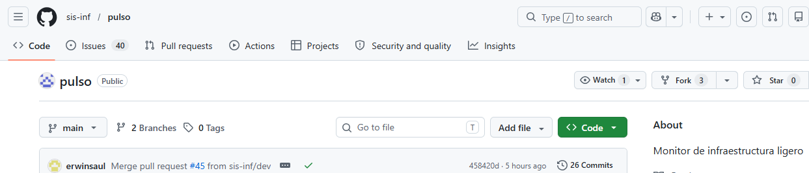

# Guía de Metodología de Trabajo:

Este documento describe las técnicas y primeros pasos que debemos hacer para el proyecto Pulso.

## 1. Como hacer un Fork
Cada integrante trabaja en su propia copia del repositorio ya copiada.
- Ir al repo oficial `sis-inf/pulso`.
- Clic en el botón **Fork**.

## 2. Creacion de una Rama
Nada se programa sin un ticket del Issues en el que queremos trabajar. 
- Antes de empezar: `git pull upstream dev`
- Crear rama: `git checkout -b tipo/nombre-tarea`

## 3. Como hacer un Commit y Push 
La rama `main` siempre está limpia. Todo ocurre en ramas cortas que se mergean rápido a `dev` donde devemos trabajar siempre.
- Commits claros: `docs: flujo de trabajo Closes #9`
- Subida de cambios: `git push origin tipo/nombre-tarea`

## 4. Como abrir un Pull Request
Nadie mergea su propio código. Se debe abrir un PR para revisión.
**IMPORTANTE** Verificar que el destino sea `sis-inf/pulso:dev`.

